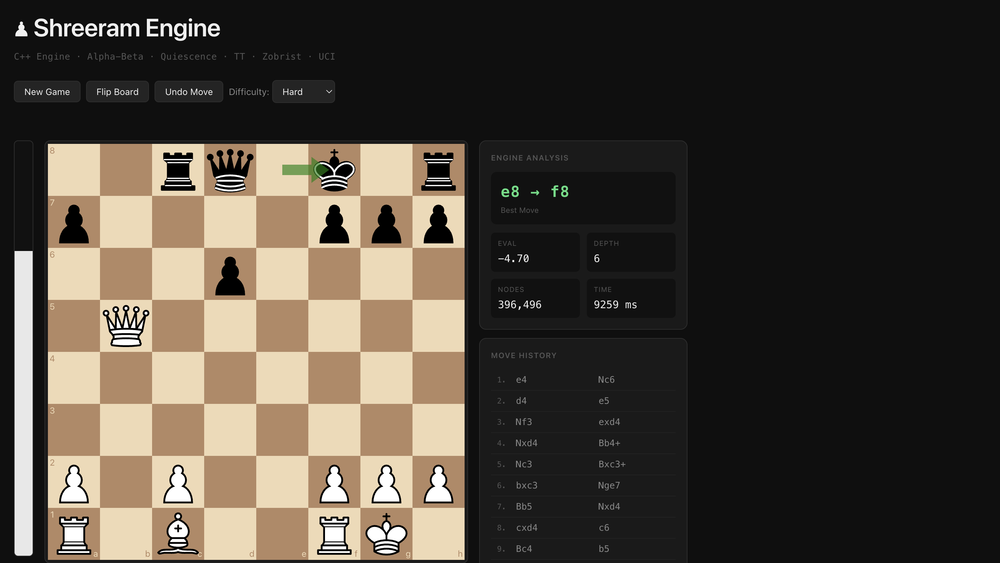

# Shreeram Engine

A Perft-validated chess engine written from scratch in C++, featuring alpha-beta search, transposition tables, Zobrist hashing, and a full-stack web interface connected through a custom UCI bridge.

## Live Demo

[🎮 Play Online](https://chess-engine-theta.vercel.app/) • [⚙️ Backend API](https://chessengine-backend.onrender.com/)

> Backend hosted on Render free tier. First request may take ~30 seconds.

---
## Web Interface



## Correctness Validation

Move generation correctness was verified using **Perft** — a standard chess-engine testing technique that counts the exact number of reachable positions at each depth from the starting position. Matching known-correct values at depth 5 validates every rule: castling, en passant, promotion, check evasion, and pin detection.

| Depth | Nodes | Status |
|------:|------:|:------:|
| 1 | 20 | ✓ |
| 2 | 400 | ✓ |
| 3 | 8,902 | ✓ |
| 4 | 197,281 | ✓ |
| 5 | 4,865,609 | ✓ |

Depth-5 Perft requires generating and validating ~4.8 million positions. Any bug in castling rights propagation, en passant legality, or pin handling causes cascading errors that fail this test. The numbers match.

---

## Architecture

The engine is structured in four independent layers. Each layer has a single owner and no upward dependencies.

```
┌─────────────────────────────────────────────────┐
│                  React Frontend                  │
│          (board UI, analysis panel, undo)        │
└─────────────────────┬───────────────────────────┘
                      │  POST /move  { fen, depth }
┌─────────────────────▼───────────────────────────┐
│              Node.js / Express                   │
│         (UCI bridge, process lifecycle)          │
└─────────────────────┬───────────────────────────┘
                      │  stdin/stdout  (UCI protocol)
┌─────────────────────▼───────────────────────────┐
│              C++ UCI Interface                   │
│       (command parsing, info line emission)      │
└─────────────────────┬───────────────────────────┘
                      │
┌─────────────────────▼───────────────────────────┐
│                 Search Engine                    │
│   negamax · alpha-beta · iterative deepening     │
│   quiescence · TT · killers · history            │
└─────────────────────┬───────────────────────────┘
                      │
┌─────────────────────▼───────────────────────────┐
│               ChessBoard / Position              │
│    legal move generation · rule enforcement      │
│    Position as value type · copy-based search    │
└─────────────────────────────────────────────────┘
```

### Key Design Decision: Position as a Value Type

`Position` is a plain 80-byte struct (64-square board array + side-to-move + castling rights + en passant square + clocks). It carries no heap allocations and defines `operator==` over all repetition-relevant fields.

Search uses **copy-based recursion**: `apply_move()` returns a new `Position`; the caller passes it into the next `negamax` call. There is no make/unmake system and no undo stack in the search path.

**Trade-off accepted:** Each node copies ~80 bytes versus a make/unmake system that mutates in place. At typical search depths (6–8 ply) this is negligible. The gain is that the search function is a pure function of its inputs — no shared mutable state, no correctness risk from mismatched make/unmake pairs, and the architecture is trivially parallelizable if parallel search is added later.

`ChessBoard` wraps one `Position` and owns all rule logic. `Game` wraps `ChessBoard` and owns session state (history, draw detection, move log). Neither leaks rule logic into the other.

---

## Search Implementation

### Algorithm

Negamax alpha-beta with iterative deepening. The engine searches depth 1 through `N`, using each completed iteration to improve move ordering for the next. The best move from the previous iteration is searched first at the next depth, ensuring early cutoffs.

Quiescence search runs at leaf nodes, extending the search through captures until a quiet position is reached. This eliminates the horizon effect where the engine misses a recapture one ply beyond its nominal depth.

### Move Ordering

The quality of move ordering determines how many nodes alpha-beta prunes. The engine applies four ordering layers:

1. **Promotions** — searched first unconditionally
2. **Captures** — ordered by MVV-LVA (Most Valuable Victim, Least Valuable Aggressor): a pawn capturing a queen scores above a queen capturing a pawn
3. **Killer moves** — two quiet moves per ply that caused a beta cutoff in a sibling node
4. **History heuristic** — quiet moves scored by how often they caused cutoffs across the entire search, indexed by `[from][to]`

### Transposition Table

Zobrist hashing assigns each position a 64-bit hash updated incrementally. The transposition table stores `(hash, depth, score, flag)` where flag is one of `Exact | LowerBound | UpperBound`. On a TT hit at sufficient depth, the cached score replaces the subtree search entirely.
This also makes iterative deepening efficient: positions searched at earlier depths are reused through TT hits during deeper iterations, reducing redundant work and improving move ordering.

---

## Full-Stack Integration

The C++ engine communicates with the Node.js backend over the **UCI protocol** (Universal Chess Interface) via stdin/stdout. This is the same protocol used by production engines (Stockfish, Leela). The backend spawns the engine as a child process per request, writes UCI commands, and parses the response.

The engine emits standard `info` lines after each iterative deepening iteration:

```
info depth 6 score cp 0 nodes 703446 time 330 pv b1c3 b8c6 d2d4 g8f6 g1f3 d7d5
bestmove b1c3
```

The backend parses the final `info` line before `bestmove` and returns structured JSON:

```json
{
  "bestMove": "e2e4",
  "evaluation": 0.43,
  "depth": 6,
  "nodes": 312451,
  "time": 812,
  "pv": "e2e4 e7e5 g1f3 a7a6 d2d4"
}
```

The React frontend renders this in a live analysis panel without any game-logic dependency on the backend — the frontend uses `chess.js` only for board rendering state; the C++ engine is the authoritative rules source.

---

## Engine Features

**Move generation:** Legal move generation for all piece types, castling (with rights propagation), en passant, pawn promotion (all four variants), check and pin detection.

**Game rules:** Checkmate and stalemate detection, threefold repetition, fifty-move rule, insufficient material, FEN import and export.

**Search:** Negamax, alpha-beta pruning, iterative deepening, quiescence search, transposition table with Zobrist hashing, killer move heuristic (2 per ply), history heuristic, move ordering.

**Protocol:** Full UCI implementation — `uci`, `isready`, `position startpos moves ...`, `position fen ...`, `go depth N`, `bestmove`, `info` line output.

**Frontend:** React + Vite, board flip, move history, undo, difficulty selection (depth 1–6), live analysis panel (evaluation, depth, nodes, time, principal variation).

---

## Stack

| Layer | Technology |
|-------|-----------|
| Engine | C++20 |
| Protocol | UCI (stdin/stdout) |
| Backend | Node.js, Express |
| Frontend | React, Vite, react-chessboard, chess.js |
| Deployment | Vercel (frontend), Render (backend) |

---

## Local Setup

```bash
# Build engine
cd oop_engine
make

# Run backend
cd backend
npm install
node index.js

# Run frontend
cd frontend
npm install
npm run dev
```

---

## Author

**Shreeram Goliya**

- ICPC Chennai Regionals — Rank 21
- ICPC India Preliminary — AIR 175
- [Codeforces Expert](https://codeforces.com/profile/shreeram77)
- [CodeChef 5★](https://www.codechef.com/users/shriramgoliya)
